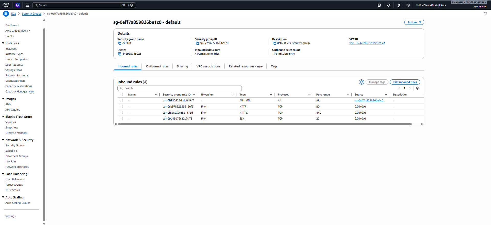
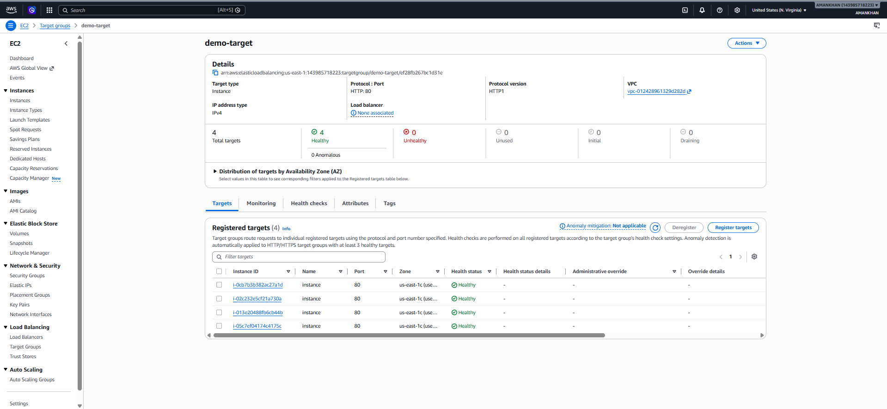
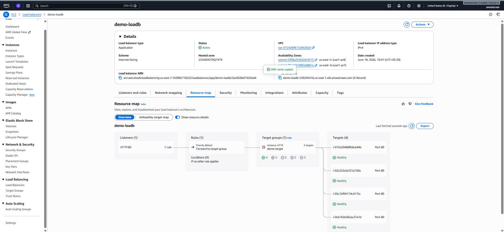
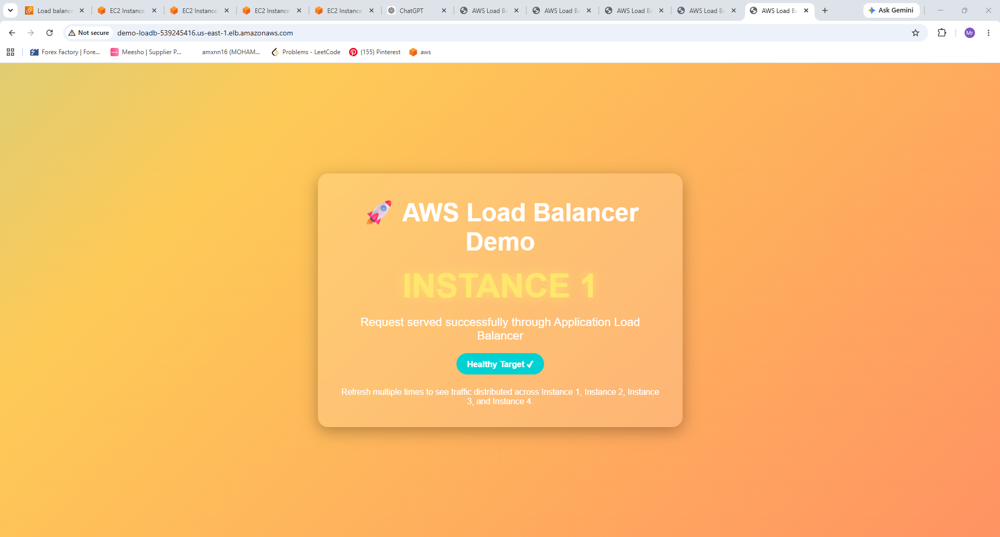
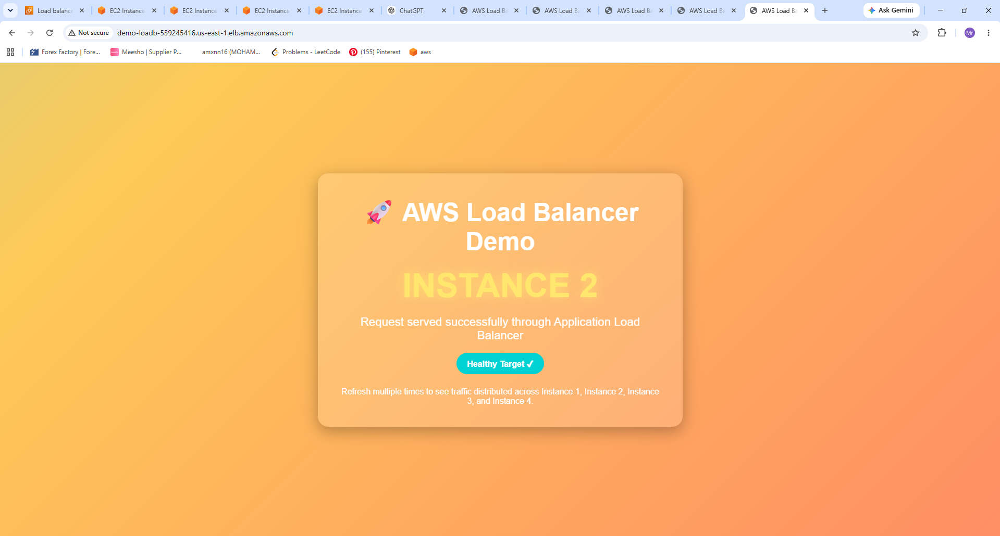
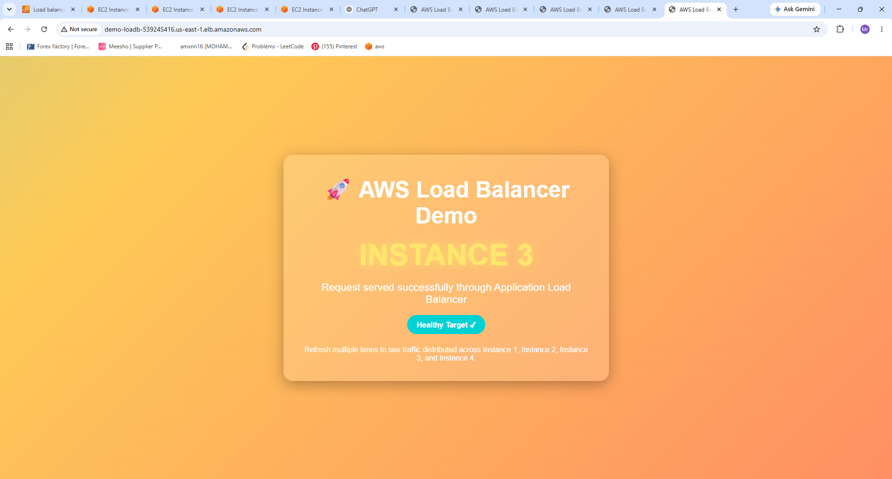

# AWS Application Load Balancer (ALB) Project

## 👨‍💻 Author
**MOHAMMED AMANKHAN**

---

# 📌 Project Overview

This project demonstrates the implementation of an AWS Application Load Balancer (ALB) that distributes incoming traffic across four EC2 instances.

The setup ensures:

- High Availability
- Load Distribution
- Fault Tolerance
- Health Monitoring
- Scalable Architecture

---

# 🏗️ Architecture

```text
                    User Request
                          |
                          V
          +--------------------------------+
          |  AWS Application Load Balancer |
          +--------------------------------+
               /      /      \       \
              /      /        \       \
             V      V          V       V

      EC2 Instance1  EC2 Instance2
      EC2 Instance3  EC2 Instance4
```

---

# ☁️ AWS Services Used

- Amazon EC2
- Application Load Balancer (ALB)
- Target Groups
- Security Groups
- Amazon VPC
- Health Checks

---

# Step 1: Launch EC2 Instances

Four EC2 instances were launched successfully.

### Screenshot

.png)

### Configuration

- AMI: Amazon Linux 2
- Instance Type: t3.micro
- Public IP Enabled
- Running State

### Outcome

All four EC2 instances were created and became available for traffic.

---

# Step 2: Configure Security Group

Inbound rules were configured to allow web and SSH access.

### Screenshot



### Rules Added

| Type | Protocol | Port |
|--------|----------|------|
| SSH | TCP | 22 |
| HTTP | TCP | 80 |
| HTTPS | TCP | 443 |

### Outcome

Instances became accessible via browser and SSH.

---

# Step 3: Create Target Group

A Target Group named **demo-target** was created.

### Screenshot



### Configuration

- Target Type: Instance
- Protocol: HTTP
- Port: 80

### Outcome

All four EC2 instances were successfully registered.

---

# Step 4: Create Application Load Balancer

An Application Load Balancer named **demo-loadb** was created.

### Screenshot



### Configuration

- Scheme: Internet Facing
- Listener: HTTP (80)
- Forwarding Rule: demo-target

### Outcome

ALB became active and ready to distribute traffic.

---

# Step 5: Health Check Verification

The ALB continuously checks the health status of all registered instances.

### Results

- Healthy Targets: 4
- Unhealthy Targets: 0

### Outcome

All instances passed health checks successfully.

---

# Step 6: Test Load Balancing

The ALB DNS URL was opened in a web browser and refreshed multiple times.

The load balancer distributed traffic among all four EC2 instances.

---

## Instance 1 Response



### Observation

Request routed successfully to Instance 1.

---

## Instance 2 Response



### Observation

Request routed successfully to Instance 2.

---

## Instance 3 Response



### Observation

Request routed successfully to Instance 3.

---

## Instance 4 Response


### Observation

Request routed successfully to Instance 4.

---

# 🔄 Project Workflow

### 1. Launch EC2 Instances
Created four EC2 instances.

### 2. Configure Security Group
Allowed inbound HTTP, HTTPS, and SSH traffic.

### 3. Create Target Group
Registered EC2 instances.

### 4. Configure Health Checks
Enabled monitoring of instance health.

### 5. Create ALB
Configured an internet-facing Application Load Balancer.

### 6. Attach Target Group
Connected the ALB to registered targets.

### 7. Test DNS Endpoint
Opened ALB DNS URL in browser.

### 8. Verify Load Distribution
Confirmed requests were distributed across all instances.

---

# ✅ Results

- Successfully launched 4 EC2 instances
- Configured Security Groups
- Created Target Group
- Configured Application Load Balancer
- Verified Health Checks
- Verified Traffic Distribution
- Achieved High Availability

---

# 🎯 Learning Outcomes

Through this project, I learned:

- EC2 Deployment
- Security Group Configuration
- Target Group Management
- Application Load Balancer Setup
- Health Check Monitoring
- Traffic Routing
- AWS Networking Concepts
- High Availability Architecture

---

# 📂 Project Structure

```text
aws-loadbalancer-demo/
│
├── README.md
│
└── screenshots/
    ├── 01-ec2-instances (2).png
    ├── 02-security-group.png
    ├── 03-target-group.png
    ├── 04-load-balancer.png
    ├── 05-instance1.png
    ├── 06-instance2.png
    ├── 07-instance3.png
    └── 08-instance4.png
```

---

# 🏆 Conclusion

This project successfully demonstrates how AWS Application Load Balancer distributes incoming requests across multiple EC2 instances while maintaining high availability and fault tolerance.

---

# 📜 License

MIT License

Copyright (c) 2026 MOHAMMED AMANKHAN

Permission is hereby granted, free of charge, to any person obtaining a copy of this software and associated documentation files to deal in the Software without restriction, including without limitation the rights to use, copy, modify, merge, publish, distribute, sublicense, and/or sell copies of the Software.

---

## Developed By

### MOHAMMED AMANKHAN
**Computer Science Engineer | AWS Cloud Enthusiast | DevOps Learner**
